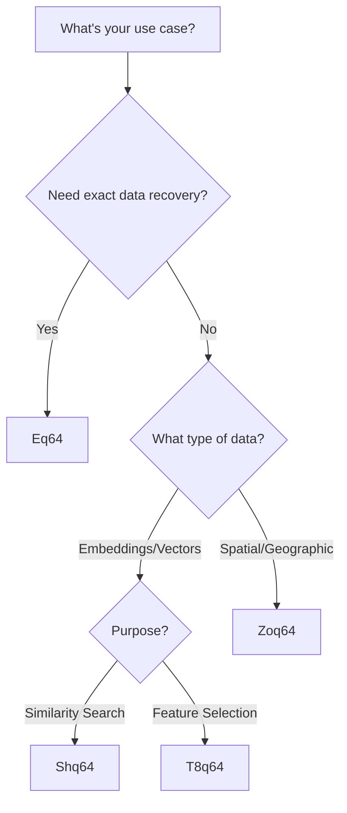

# The QuadB64 Family: A Suite of Position-Safe Encodings

## Overview

The QuadB64 family consists of four specialized encoding schemes, each optimized for different use cases while maintaining the core principle of position safety. This modular approach allows you to choose the perfect encoding for your specific needs without compromising on substring pollution prevention.

## Family Members at a Glance

| Encoding | Purpose | Output Size | Reversible | Best For |
|----------|---------|-------------|------------|----------|
| **Eq64** | Full fidelity encoding | ~1.33x input | ✅ Yes | Complete data preservation |
| **Shq64** | Similarity hashing | 16 chars (fixed) | ❌ No | Deduplication, clustering |
| **T8q64** | Sparse representation | 16 chars (fixed) | ❌ No | Feature extraction |
| **Zoq64** | Spatial encoding | Variable | ❌ No | Geospatial, multi-dimensional |

## Core Design Principles

All QuadB64 family members share these fundamental characteristics:

### 1. Position Safety
Every encoding incorporates positional information, making arbitrary substring matches impossible:

```python
# Traditional Base64 - position-agnostic
base64("ABC") at position 0 == base64("ABC") at position 100

# QuadB64 - position-aware
quad64("ABC", pos=0) != quad64("ABC", pos=100)
```

### 2. Dot-Separated Chunks
Visual and algorithmic boundaries every 4 characters:

```
Traditional: SGVsbG8gV29ybGQh
QuadB64:     SGVs.bG8g.V29y.bGQh
```

### 3. Consistent Alphabet
All variants use the same 64-character alphabet with position-dependent permutations:
- Letters: A-Z, a-z (52 chars)
- Digits: 0-9 (10 chars)
- Special: . and / (2 chars)

### 4. Search Engine Friendly
Designed specifically for modern search infrastructure:
- No characters that require URL encoding
- Compatible with tokenizers
- Preserves word boundaries with dots

## Choosing the Right Encoding

### Decision Tree



### Use Case Matrix

| Scenario | Recommended | Why |
|----------|-------------|-----|
| Storing ML embeddings | Eq64 | Full precision needed |
| Deduplication system | Shq64 | Fast similarity comparison |
| Search engine integration | Eq64 or Shq64 | Depends on precision needs |
| Recommendation systems | T8q64 | Sparse features suffice |
| Mapping applications | Zoq64 | Spatial locality preserved |
| Document fingerprinting | Shq64 | Compact, similarity-aware |
| Binary file storage | Eq64 | Lossless requirement |

## Performance Characteristics

### Encoding Speed (MB/s)

```
Eq64:   ████████████████████ 230 MB/s (with native)
Shq64:  ██████████ 117 MB/s (with native)
T8q64:  █████████████ 156 MB/s (with native)
Zoq64:  ████████████████████████████████████████ 480 MB/s (with native)
```

### Space Efficiency

```python
# Original: 768-dimensional float32 embedding (3072 bytes)
original_size = 3072

# Encoded sizes
eq64_size = 4096    # ~1.33x (same as Base64)
shq64_size = 16     # 0.005x (192x compression!)
t8q64_size = 16     # 0.005x (sparse representation)
zoq64_size = 32     # 0.01x (for 2D spatial, adjustable)
```

## Implementation Architecture

### Shared Components

All family members share a common architecture:

```python
class QuadB64Encoder:
    def __init__(self, variant: str):
        self.variant = variant
        self.alphabets = self._init_alphabets()
        self.position = 0
    
    def _get_alphabet(self, position: int) -> str:
        """Returns position-specific alphabet"""
        phase = position % 4
        return self.alphabets[phase]
    
    def encode(self, data: bytes) -> str:
        """Variant-specific encoding logic"""
        raise NotImplementedError
```

### Variant-Specific Logic

Each variant implements its own encoding strategy:

- **Eq64**: Direct byte-to-character mapping with position rotation
- **Shq64**: SimHash generation followed by position-safe encoding
- **T8q64**: Top-k selection algorithm with magnitude preservation
- **Zoq64**: Z-order curve calculation with adaptive precision

## Integration Patterns

### Unified API

```python
from uubed import encode, decode

# Automatic variant selection based on method
encoded = encode(data, method="eq64")   # Full encoding
hashed = encode(data, method="shq64")   # Similarity hash
sparse = encode(data, method="t8q64")   # Top-k indices
spatial = encode(data, method="zoq64")  # Z-order encoding

# Decoding (only supported for Eq64)
original = decode(encoded)  # Works
decode(hashed)  # Raises: NotReversibleError
```

### Variant Detection

```python
from uubed import detect_variant

encoded_string = "SGVs.bG8g.V29y.bGQh"
variant = detect_variant(encoded_string)
print(f"This is {variant} encoding")  # "This is eq64 encoding"
```

### Batch Operations

```python
from uubed import BatchEncoder

# Efficient batch processing
encoder = BatchEncoder(method="shq64")
embeddings = [...]  # List of 1000 embeddings
encoded_batch = encoder.encode_all(embeddings)  # Parallel processing
```

## Advanced Features

### Hybrid Encoding

Combine multiple variants for complex use cases:

```python
from uubed import HybridEncoder

# Store full + compact representation
hybrid = HybridEncoder(primary="eq64", secondary="shq64")
result = hybrid.encode(embedding)
# Returns: {"full": "...", "compact": "...", "variant": "hybrid"}
```

### Custom Alphabets

For specialized domains:

```python
from uubed import CustomQuadB64

# Domain-specific alphabet (e.g., DNA sequences)
dna_encoder = CustomQuadB64(
    alphabet="ACGT" * 16,  # Must be 64 chars
    variant="eq64"
)
```

### Streaming Support

For large-scale processing:

```python
from uubed import StreamEncoder

# Process large files efficiently
with StreamEncoder("eq64") as encoder:
    with open("embeddings.bin", "rb") as f:
        for chunk in iter(lambda: f.read(4096), b''):
            encoded_chunk = encoder.encode_chunk(chunk)
            process(encoded_chunk)
```

## Security Considerations

While QuadB64 is not a security tool, it offers some interesting properties:

1. **Pattern Obfuscation**: Position-dependent encoding makes pattern analysis harder
2. **No Information Leakage**: Encoded strings don't reveal position information
3. **Tamper Evidence**: Modified characters likely break position consistency

**Important**: QuadB64 is NOT encryption. Use proper cryptographic tools for security needs.

## Future Directions

The QuadB64 family is designed for extensibility:

### Planned Variants

- **Mq64**: Matryoshka embedding support with nested precision
- **Hq64**: Hierarchical encoding for tree structures
- **Cq64**: Compression-aware variant for bandwidth optimization

### Research Areas

- Integration with homomorphic encryption
- Quantum-resistant variants
- Hardware acceleration (GPU/TPU)
- Distributed encoding protocols

## Summary

The QuadB64 family provides a comprehensive solution to substring pollution while offering flexibility for various use cases. Whether you need full fidelity with Eq64, compact hashes with Shq64, sparse representations with T8q64, or spatial encoding with Zoq64, there's a variant optimized for your needs.

Choose your variant based on:
- **Data recovery needs**: Reversible (Eq64) vs. one-way (others)
- **Size constraints**: Full size vs. fixed compact representations
- **Use case**: Similarity, sparsity, or spatial relationships
- **Performance requirements**: All variants support native acceleration

Next, explore each variant in detail:
- [Eq64: Full Embeddings](eq64.md)
- [Shq64: SimHash Variant](shq64.md)
- [T8q64: Top-k Indices](t8q64.md)
- [Zoq64: Z-order Encoding](zoq64.md)